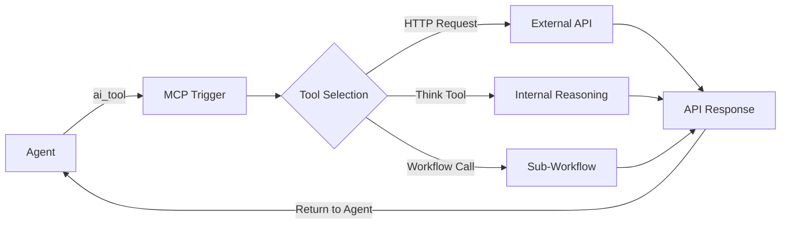
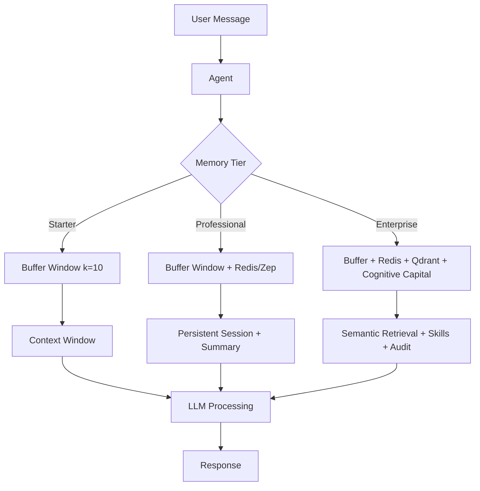
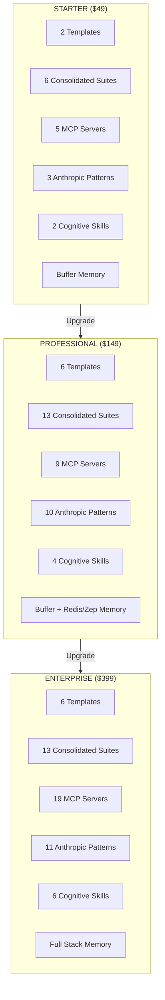
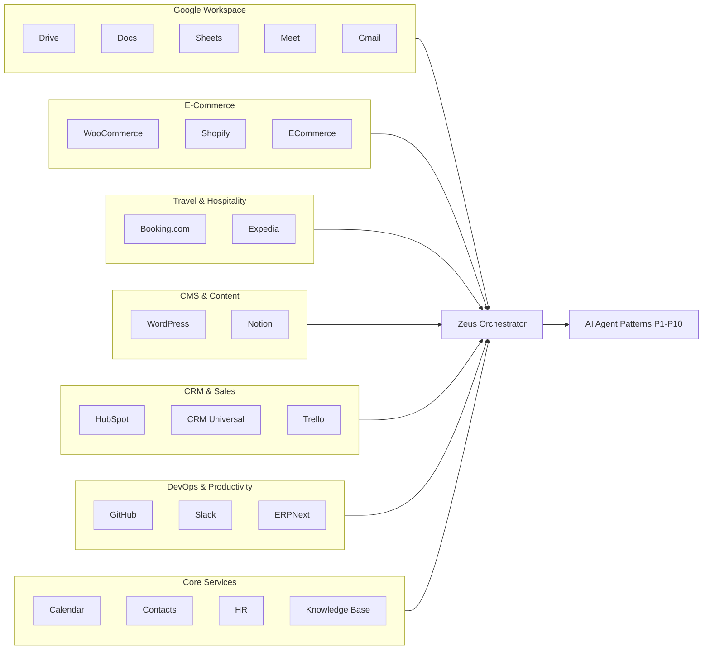

# JARVIS AI Automation — Architecture Documentation

> **Version**: 4.0.0 | **Zero Technical Debt** | **Anthropic Patterns** | **Cognitive Capital**
> **Last Updated**: 2026-07-30
> **Total Workflows**: 51+ | **MCP Servers**: 19 | **Anthropic Patterns**: 11 | **Memory Tiers**: 3

---

## Table of Contents

1. [System Overview](#1-system-overview)
2. [Architecture Flow Diagrams](#2-architecture-flow-diagrams)
3. [Anthropic Pattern Selection Guide](#3-anthropic-pattern-selection-guide)
4. [MCP Server Ecosystem](#4-mcp-server-ecosystem)
5. [Memory Architecture](#5-memory-architecture)
6. [Tiered Package Comparison](#6-tiered-package-comparison)
7. [Quick Reference Table — All Workflows](#7-quick-reference-table--all-workflows)
8. [Integration Map](#8-integration-map)
9. [Deployment Architecture](#9-deployment-architecture)
10. [LLM Tiering Strategy](#10-llm-tiering-strategy)

---

## 1. System Overview

JARVIS is a production-ready AI automation platform built on n8n with Anthropic's agent patterns, IBM's AI Agent architecture, and DeerFlow's multi-agent orchestration. The system is organized into three tiers — Starter, Professional, and Enterprise — each providing progressively more capabilities, memory depth, and integration breadth.

### Core Principles

| Principle | Description |
|-----------|-------------|
| **Zero Technical Debt** | Every workflow has real node types, correct ai_* connections, $fromAI() expressions, and no placeholder credentials |
| **Anthropic Patterns** | 11 agent patterns (P1-P10 + Zeus) implementing proven multi-agent architectures |
| **Cognitive Capital** | Skills-as-SKILL.md files with progressive disclosure, loaded dynamically into agent memory |
| **Tiered LLMs** | GPT-4o-mini (routing) → GPT-4.1-mini (mid) → GPT-4.1 (complex) → Claude Sonnet (enterprise) |
| **MCP Standard** | All tools exposed as MCP servers for universal interoperability |

### Architecture Layers

```
┌─────────────────────────────────────────────────────────────┐
│                    ZEUS META-ORCHESTRATOR                    │
│         (Analyzes request → Selects pattern P1-P10)         │
├─────────────────────────────────────────────────────────────┤
│              ANTHROPIC PATTERN LAYER (P1-P10)               │
│  P1: Chaining │ P2: Routing │ P3: Orchestrator-Workers     │
│  P4: Evaluator │ P5: Parallel │ P6: Cognitive Capital      │
│  P7: SOUL Bootstrap │ P8: Router+Orch │ P9: Eval+Parallel  │
│  P10: Cognitive+SOUL                                        │
├─────────────────────────────────────────────────────────────┤
│                    MCP SERVER LAYER (19)                     │
│  Google Workspace │ CRM │ Booking │ Expedia │ WooCommerce   │
│  Shopify │ WordPress │ ERPNext │ Slack │ Notion │ GitHub   │
│  Trello │ HubSpot │ Calendar │ Gmail │ Contacts │ HR       │
│  Knowledge Base │ ECommerce                                 │
├─────────────────────────────────────────────────────────────┤
│                     MEMORY LAYER (3 Tiers)                  │
│  Starter: Buffer Window (10 exchanges, in-session)          │
│  Professional: Buffer + Redis/Zep (cross-session, summary)  │
│  Enterprise: Buffer + Redis + Qdrant RAG + Cognitive Capital│
├─────────────────────────────────────────────────────────────┤
│                   INFRASTRUCTURE LAYER                       │
│  n8n │ PostgreSQL │ Redis │ Qdrant │ Zep │ Nginx            │
│  Prometheus │ Grafana │ Docker Compose                       │
└─────────────────────────────────────────────────────────────┘
```

---

## 2. Architecture Flow Diagrams

### 2.1 Zeus Meta-Orchestrator Flow

```mermaid
flowchart TD
    A[User Request] --> B[Chat Trigger]
    B --> C[Zeus Agent - GPT-4.1]
    C --> D{Pattern Analysis}
    D -->|Simple sequential| P1[P1: Prompt Chaining]
    D -->|Multi-domain| P2[P2: Smart Routing]
    D -->|Complex decomposition| P3[P3: Orchestrator-Workers]
    D -->|Quality-critical| P4[P4: Evaluator-Optimizer]
    D -->|Multi-perspective| P5[P5: Parallelization]
    D -->|Skill loading| P6[P6: Cognitive Capital]
    D -->|Personality creation| P7[P7: SOUL Bootstrap]
    D -->|Routing + delegation| P8[P8: Router-Orchestrator]
    D -->|Parallel + quality| P9[P9: Evaluator-Parallel]
    D -->|Personality + skills| P10[P10: Cognitive-SOUL]
    P1 --> E[Result Aggregation]
    P2 --> E
    P3 --> E
    P4 --> E
    P5 --> E
    P6 --> E
    P7 --> E
    P8 --> E
    P9 --> E
    P10 --> E
    E --> F[Structured Output]
    F --> G[User Response]
```



### 2.2 MCP Server Request Flow



### 2.3 Memory Architecture Flow



### 2.4 Tiered Package Architecture



### 2.5 Ecosystem Integration Map



---

## 3. Anthropic Pattern Selection Guide

### Decision Matrix

| # | Pattern | When to Use | Complexity | LLM Tier | Best For |
|---|---------|-------------|------------|----------|----------|
| **P1** | Prompt Chaining | Sequential multi-step tasks (research→draft→polish) | Medium | GPT-4o-mini | Content pipelines, report generation |
| **P2** | Smart Routing | Multi-domain intent classification | Medium-High | GPT-4.1-mini | Customer service, multi-topic assistants |
| **P3** | Orchestrator-Workers | Complex task decomposition into subtasks | High | GPT-4.1 | Project management, research synthesis |
| **P4** | Evaluator-Optimizer | Quality-gated iterative refinement | Medium-High | GPT-4.1-mini | Content review, code review, QA |
| **P5** | Parallelization | Multi-perspective analysis simultaneously | Medium | GPT-4.1-mini | Market analysis, competitive intelligence |
| **P6** | Cognitive Capital MCP | Dynamic skill loading for agents | Medium | GPT-4.1-mini | Specialized tasks, skill-as-a-service |
| **P7** | SOUL Bootstrap | AI personality creation via conversation | Low | GPT-4o-mini | Brand voice, persona creation |
| **P8** | Router-Orchestrator | Smart routing + task delegation to teams | High | GPT-4.1 | Complex operations, multi-team coordination |
| **P9** | Evaluator-Parallel | Multi-perspective analysis + quality gates | High | GPT-4.1 | Strategic analysis, due diligence |
| **P10** | Cognitive-SOUL | Personality bootstrap + skill loading | Medium | GPT-4.1-mini | Custom AI assistants with expertise |
| **Zeus** | Meta-Orchestrator | Dynamic pattern selection from P1-P10 | Very High | GPT-4.1 | Universal AI assistant, auto-routing |

### Selection Algorithm

```
1. Is the request a single sequential task?
   → YES: Use P1 (Prompt Chaining)
   → NO: Continue

2. Does the request span multiple domains/topics?
   → YES: Does it need task decomposition?
      → YES: Use P8 (Router-Orchestrator)
      → NO: Use P2 (Smart Routing)
   → NO: Continue

3. Is the task complex enough to need workers?
   → YES: Use P3 (Orchestrator-Workers)
   → NO: Continue

4. Does quality matter enough to iterate?
   → YES: Do we need multiple perspectives?
      → YES: Use P9 (Evaluator-Parallel)
      → NO: Use P4 (Evaluator-Optimizer)
   → NO: Continue

5. Do we need multiple perspectives simultaneously?
   → YES: Use P5 (Parallelization)
   → NO: Continue

6. Is this about creating/loading an AI personality?
   → YES: Do we also need skills?
      → YES: Use P10 (Cognitive-SOUL)
      → NO: Use P7 (SOUL Bootstrap)
   → NO: Continue

7. Do we need to load specific skills dynamically?
   → YES: Use P6 (Cognitive Capital MCP)
   → NO: Use Zeus Meta-Orchestrator (re-analyze)
```

### Pattern Combination Guide

| Combination | Result Pattern | Use Case |
|-------------|---------------|----------|
| P2 + P3 | P8 Router-Orchestrator | Route requests to specialized worker teams |
| P4 + P5 | P9 Evaluator-Parallel | Parallel analysis with quality gates |
| P6 + P7 | P10 Cognitive-SOUL | Bootstrap personality with dynamic skills |
| P1 + P2 | Chained routing | Multi-step with domain-specific routing |
| P3 + P5 | Parallel orchestration | Complex task with parallel worker streams |
| P4 + P6 | Skill-gated evaluation | Quality check with skill-specific criteria |
| P8 + P9 | Full enterprise orchestration | Router + parallel + quality (Zeus delegates) |

---

## 4. MCP Server Ecosystem

### 4.1 Complete MCP Server Catalog

| # | Server | Tools | Category | Tier Availability |
|---|--------|-------|----------|-------------------|
| 1 | **Google Workspace** | 8 (Drive, Docs, Sheets, Meet, Gmail) | Productivity | Professional+ |
| 2 | **CRM Universal** | 8 (Contacts, Leads, Pipeline, Deals, Activities, Dashboard) | Sales | Professional+ |
| 3 | **Booking.com** | 8 (Properties, Reservations, Availability, Reviews, Rates) | Travel | Enterprise |
| 4 | **Expedia** | 8 (Hotels, Flights, Cars, Packages, Bookings) | Travel | Enterprise |
| 5 | **WooCommerce** | 8 (Products, Orders, Customers, Coupons, Analytics) | E-Commerce | Professional+ |
| 6 | **Shopify** | 8 (Products, Inventory, Orders, Fulfillment, Discounts) | E-Commerce | Enterprise |
| 7 | **WordPress** | 8 (Posts, Pages, Media, Comments, Users, Stats) | CMS | Professional+ |
| 8 | **ERPNext** | 8 (GL, Invoices, POs, Stock, Employees, Projects, Reports) | ERP | Enterprise |
| 9 | **Slack** | 7 (Messages, Channels, Search, Threads, Reactions, Files) | Communication | Starter+ |
| 10 | **Notion** | 7 (Search, Pages, Databases, Blocks) | Knowledge | Professional+ |
| 11 | **GitHub** | 7 (Repos, Issues, PRs, Code, Files) | DevOps | Professional+ |
| 12 | **Trello** | 6 (Boards, Cards, Comments) | Project Mgmt | Enterprise |
| 13 | **HubSpot** | 7 (Contacts, Deals, Companies) | CRM | Enterprise |
| 14 | **Calendar** | 6 (Events, Availability, Reminders) | Core | Starter+ |
| 15 | **Gmail** | 6 (Send, Read, Search, Labels) | Core | Starter+ |
| 16 | **Contacts** | 6 (List, Create, Update, Search) | Core | Starter+ |
| 17 | **ECommerce** | 6 (Products, Orders, Categories) | Commerce | Professional+ |
| 18 | **HR** | 6 (Employees, Leave, Payroll, Reviews) | HR | Professional+ |
| 19 | **Knowledge Base** | 6 (Search, Create, Update, Delete) | Knowledge | Starter+ |

### 4.2 Total Tool Count

| Category | Servers | Tools |
|----------|---------|-------|
| New (Phase 5) | 8 | 64 |
| Phase 4 | 5 | 34 |
| Phase 2-3 | 6 | 36 |
| **Total** | **19** | **134** |

---

## 5. Memory Architecture

### 5.1 Tiered Memory Comparison

| Feature | Starter | Professional | Enterprise |
|---------|---------|-------------|------------|
| **Type** | Buffer Window | Buffer + Redis/Zep | Buffer + Redis + Qdrant + Cognitive Capital |
| **Context Window** | 10 exchanges | 20 exchanges | 50 exchanges |
| **Cross-Session** | ❌ No | ✅ Yes (Redis/Zep) | ✅ Yes (Redis/Zep) |
| **Long-term Recall** | ❌ No | ✅ Summarization | ✅ Semantic Retrieval |
| **Knowledge Retrieval** | ❌ No | ❌ No | ✅ Qdrant Vector RAG |
| **Dynamic Skills** | ❌ No | ❌ No | ✅ Cognitive Capital |
| **Audit Trail** | ❌ No | ❌ No | ✅ Full logging |
| **Compliance** | ❌ No | ❌ No | ✅ Governance layer |
| **Conversation Summary** | ❌ No | ✅ Yes | ✅ Yes + archival |
| **Personalization** | ❌ No | ✅ Preferences | ✅ SOUL personality |
| **Memory Persistence** | In-session only | Redis-backed | Multi-store (Redis + Qdrant + PG) |

### 5.2 Memory Workflow Architecture

```
Starter Memory Flow:
  User → Agent → [BufferWindow k=10] → LLM → Response

Professional Memory Flow:
  User → Agent → [BufferWindow k=20] → [Redis/Zep Lookup] → LLM → [Structured Output] → Response

Enterprise Memory Flow:
  User → Agent → [BufferWindow k=50] → [Redis/Zep] → [Qdrant RAG] → [Cognitive Capital] → LLM → [Compliance Check] → [Audit Log] → Response
```

---

## 6. Tiered Package Comparison

| Feature | Starter ($49) | Professional ($149) | Enterprise ($399) |
|---------|---------------|---------------------|-------------------|
| **Total Workflows** | 16 | 38 | 51+ |
| **Templates** | 2 | 6 | 6 |
| **Consolidated Suites** | 6 | 13 | 13 |
| **MCP Servers** | 5 | 9 | 19 |
| **Anthropic Patterns** | 3 | 10 | 11 |
| **Cognitive Skills** | 2 | 4 | 6 |
| **Memory Tier** | Buffer | Buffer + Redis | Full Stack |
| **Docker Services** | n8n, postgres | + qdrant, redis | + nginx, prometheus, grafana, zep |
| **LLM Tier** | GPT-4o-mini | + GPT-4.1-mini | + GPT-4.1, Claude |
| **E-Commerce** | ❌ | WooCommerce | + Shopify |
| **Google Workspace** | ❌ | ✅ | ✅ |
| **Booking/Expedia** | ❌ | ❌ | ✅ |
| **ERPNext** | ❌ | ❌ | ✅ |
| **WordPress** | ❌ | ✅ | ✅ |
| **CRM** | ❌ | ✅ | ✅ |
| **Governance** | ❌ | ❌ | ✅ |
| **Est. Monthly Cost** | $5-15 | $25-75 | $75-250 |

---

## 7. Quick Reference Table — All Workflows

### 7.1 Templates (T1-T6)

| ID | Name | Description | Tier |
|----|------|-------------|------|
| T1 | Single Agent Chat | Basic chat agent with LLM and memory | Starter+ |
| T2 | Agent + MCP Tool | Agent with HTTP tool for external API calls | Professional+ |
| T3 | RAG Agent | Agent with vector store for knowledge retrieval | Professional+ |
| T4 | Multi-Agent Orchestrator | Coordinator agent delegating to specialist workers | Professional+ |
| T5 | Error Handler | Global error handling with retry and fallback | Professional+ |
| T6 | MCP Server | Template for creating new MCP servers | Starter+ |

### 7.2 Consolidated Suites (G1-G13)

| ID | Name | Tools | MCP Servers | Tier |
|----|------|-------|-------------|------|
| G1 | Calendar Suite | Calendar operations, scheduling, reminders | Calendar | Starter+ |
| G2 | Gmail Suite | Email management, search, labeling | Gmail | Starter+ |
| G3 | Contacts Suite | Contact management, search, CRM | Contacts | Starter+ |
| G4 | E-Commerce Suite | Product management, orders, customers | ECommerce | Professional+ |
| G5 | Marketing Multi-Agent | Multi-channel marketing orchestration | — | Professional+ |
| G6 | Platform Assistant | Cross-platform assistant | — | Professional+ |
| G7 | Images & Appointments | Image generation + appointment scheduling | Calendar | Starter+ |
| G8 | Video Viral Suite | Video content creation and distribution | — | Starter+ |
| G9 | Social Scraper | Social media data extraction | — | Professional+ |
| G10 | HR AI Agent | Employee management, leave, payroll | HR | Professional+ |
| G11 | WhatsApp AI Agent | WhatsApp integration and automation | — | Professional+ |
| G12 | Flowise RAG Suite | Advanced RAG with Flowise integration | Knowledge Base | Starter+ |
| G13 | Global Error Handler | System-wide error management | — | Professional+ |

### 7.3 MCP Servers (19 Servers, 134 Tools)

| ID | Server | Tools | Category | New | Tier |
|----|--------|-------|----------|-----|------|
| M1 | Google Workspace | 8 | Productivity | ✅ | Professional+ |
| M2 | CRM Universal | 8 | Sales | ✅ | Professional+ |
| M3 | Booking.com | 8 | Travel | ✅ | Enterprise |
| M4 | Expedia | 8 | Travel | ✅ | Enterprise |
| M5 | WooCommerce | 8 | E-Commerce | ✅ | Professional+ |
| M6 | Shopify | 8 | E-Commerce | ✅ | Enterprise |
| M7 | WordPress | 8 | CMS | ✅ | Professional+ |
| M8 | ERPNext | 8 | ERP | ✅ | Enterprise |
| M9 | Slack | 7 | Communication | — | Starter+ |
| M10 | Notion | 7 | Knowledge | — | Professional+ |
| M11 | GitHub | 7 | DevOps | — | Professional+ |
| M12 | Trello | 6 | Project Mgmt | — | Enterprise |
| M13 | HubSpot | 7 | CRM | — | Enterprise |
| M14 | Calendar | 6 | Core | — | Starter+ |
| M15 | Gmail | 6 | Core | — | Starter+ |
| M16 | Contacts | 6 | Core | — | Starter+ |
| M17 | ECommerce | 6 | Commerce | — | Professional+ |
| M18 | HR | 6 | HR | — | Professional+ |
| M19 | Knowledge Base | 6 | Knowledge | — | Starter+ |

### 7.4 Anthropic Patterns (P1-P10 + Zeus)

| ID | Name | Pattern | Combines | Nodes | Connections | Tier |
|----|------|---------|----------|-------|-------------|------|
| P1 | Prompt Chaining | Sequential | — | 7 | 6 | Starter+ |
| P2 | Smart Routing | Classification | — | 8 | 7 | Professional+ |
| P3 | Orchestrator-Workers | Decomposition | — | 9 | 8 | Professional+ |
| P4 | Evaluator-Optimizer | Iterative | — | 8 | 7 | Professional+ |
| P5 | Parallelization | Concurrent | — | 8 | 7 | Professional+ |
| P6 | Cognitive Capital MCP | Skill loading | — | 7 | 6 | Enterprise |
| P7 | SOUL Bootstrap | Personality | — | 7 | 6 | Starter+ |
| P8 | Router-Orchestrator | P2+P3 | Routing + Decomposition | 12 | 11 | Professional+ |
| P9 | Evaluator-Parallel | P4+P5 | Quality + Concurrent | 14 | 13 | Professional+ |
| P10 | Cognitive-SOUL | P6+P7 | Skills + Personality | 10 | 9 | Starter+ |
| Zeus | Meta-Orchestrator | All | Dynamic P1-P10 selection | 48 | 50 | Professional+ |

### 7.5 Memory Architecture Workflows

| ID | Name | Tier | Memory Stack | Nodes |
|----|------|------|-------------|-------|
| MEM-S | Starter Buffer | Starter | BufferWindow k=10 | 7 |
| MEM-P | Professional Enhanced | Professional | Buffer + Redis/Zep | 9 |
| MEM-E | Enterprise Full | Enterprise | Buffer + Redis + Qdrant + Cognitive Capital | 11 |

---

## 8. Integration Map

### 8.1 External Platform Integrations

```
┌──────────────────────────────────────────────────────────────┐
│                    JARVIS AI PLATFORM                        │
│                                                              │
│  ┌─────────────┐  ┌─────────────┐  ┌─────────────┐        │
│  │  Google      │  │  CRM        │  │  Travel      │        │
│  │  Workspace   │  │  Universal  │  │  Booking     │        │
│  │  ──────      │  │  ──────     │  │  Expedia     │        │
│  │  Drive       │  │  Leads      │  │  ──────      │        │
│  │  Docs        │  │  Pipeline   │  │  Hotels      │        │
│  │  Sheets      │  │  Deals      │  │  Flights     │        │
│  │  Meet        │  │  Activities │  │  Cars        │        │
│  │  Gmail       │  │  Dashboard  │  │  Packages    │        │
│  └─────────────┘  └─────────────┘  └─────────────┘        │
│                                                              │
│  ┌─────────────┐  ┌─────────────┐  ┌─────────────┐        │
│  │  E-Commerce  │  │  CMS        │  │  ERP         │        │
│  │  ──────      │  │  ──────     │  │  ──────      │        │
│  │  WooCommerce │  │  WordPress  │  │  ERPNext     │        │
│  │  Shopify     │  │  Notion     │  │  ──────      │        │
│  │  ──────      │  │  ──────     │  │  GL/AP/AR    │        │
│  │  Products    │  │  Posts      │  │  Inventory   │        │
│  │  Orders      │  │  Pages      │  │  HR          │        │
│  │  Inventory   │  │  Media      │  │  Projects    │        │
│  │  Analytics   │  │  Users      │  │  Reports     │        │
│  └─────────────┘  └─────────────┘  └─────────────┘        │
│                                                              │
│  ┌─────────────┐  ┌─────────────┐  ┌─────────────┐        │
│  │  DevOps      │  │  Project    │  │  Comm        │        │
│  │  ──────      │  │  ──────     │  │  ──────      │        │
│  │  GitHub      │  │  Trello     │  │  Slack       │        │
│  │  ──────      │  │  ──────     │  │  ──────      │        │
│  │  Repos       │  │  Boards     │  │  Channels    │        │
│  │  Issues      │  │  Cards      │  │  Messages    │        │
│  │  PRs         │  │  Comments   │  │  Threads     │        │
│  │  Code        │  │  Lists      │  │  Reactions   │        │
│  └─────────────┘  └─────────────┘  └─────────────┘        │
└──────────────────────────────────────────────────────────────┘
```

### 8.2 HubSpot vs CRM Universal vs ERPNext

| Feature | HubSpot | CRM Universal | ERPNext |
|---------|---------|---------------|---------|
| **Scope** | CRM + Marketing | CRM Core | Full ERP |
| **Contacts** | ✅ | ✅ | ✅ |
| **Deals** | ✅ | ✅ | ✅ (Invoices) |
| **Pipeline** | ✅ | ✅ | ✅ |
| **Marketing** | ✅ | ❌ | ❌ |
| **Accounting** | ❌ | ❌ | ✅ (GL/AP/AR) |
| **Inventory** | ❌ | ❌ | ✅ |
| **HR** | ❌ | ❌ | ✅ |
| **Projects** | ❌ | ❌ | ✅ |
| **Use Case** | Mid-market CRM | Any CRM API | Enterprise ERP |

---

## 9. Deployment Architecture

### 9.1 Docker Services by Tier

| Service | Starter | Professional | Enterprise | Purpose |
|---------|---------|-------------|------------|---------|
| **n8n** | ✅ | ✅ | ✅ | Workflow engine |
| **postgres** | ✅ | ✅ | ✅ | Primary database |
| **qdrant** | ❌ | ✅ | ✅ | Vector database (RAG) |
| **redis** | ❌ | ✅ | ✅ | Cache + session store |
| **nginx** | ❌ | ❌ | ✅ | Reverse proxy + SSL |
| **prometheus** | ❌ | ❌ | ✅ | Metrics collection |
| **grafana** | ❌ | ❌ | ✅ | Monitoring dashboards |
| **zep** | ❌ | ❌ | ✅ | Long-term memory server |

### 9.2 Network Architecture

```
Internet → Nginx (Enterprise) → n8n (all tiers)
                                    ↓
                            PostgreSQL (all tiers)
                            Redis (Professional+)
                            Qdrant (Professional+)
                            Zep (Enterprise)
```

---

## 10. LLM Tiering Strategy

### 10.1 Model Selection by Task Complexity

| Complexity | Model | Cost/1M Tokens | Use Cases |
|------------|-------|----------------|-----------|
| **Simple** | GPT-4o-mini | $0.15/$0.60 | Routing, basic chat, simple classification |
| **Medium** | GPT-4.1-mini | $0.40/$1.60 | Multi-domain routing, content generation, analysis |
| **Complex** | GPT-4.1 | $2.00/$8.00 | Strategic analysis, orchestration, quality evaluation |
| **Enterprise** | Claude Sonnet | $3.00/$15.00 | Governance, compliance, synthesis, final review |

### 10.2 Pattern → LLM Mapping

| Pattern | Primary LLM | Fallback LLM | Reasoning |
|---------|-------------|-------------|-----------|
| P1 | GPT-4o-mini | GPT-4.1-mini | Sequential tasks, moderate complexity |
| P2 | GPT-4.1-mini | GPT-4.1 | Multi-domain classification needs context |
| P3 | GPT-4.1 | GPT-4.1-mini | Decomposition requires deep understanding |
| P4 | GPT-4.1-mini | GPT-4.1 | Evaluation needs moderate reasoning |
| P5 | GPT-4.1-mini | GPT-4.1 | Parallel tasks, moderate per-stream |
| P6 | GPT-4.1-mini | GPT-4.1 | Skill loading, moderate reasoning |
| P7 | GPT-4o-mini | GPT-4.1-mini | Conversational, low complexity |
| P8 | GPT-4.1 | Claude Sonnet | Complex routing + orchestration |
| P9 | GPT-4.1 | Claude Sonnet | Parallel + quality, high complexity |
| P10 | GPT-4.1-mini | GPT-4.1 | Personality + skills, moderate |
| Zeus | GPT-4.1 | Claude Sonnet | Meta-orchestration, highest complexity |

---

## Appendix: File Locations

| Path | Contents |
|------|----------|
| `anthropic_patterns/` | P1-P10 + Zeus Meta-Orchestrator JSONs |
| `mcp_servers/` | 19 MCP server JSONs |
| `base_templates/` | T1-T6 template JSONs |
| `consolidated/` | G1-G13 consolidated suite JSONs |
| `cognitive_capital/` | SKILL.md files + SOUL.template.md |
| `jarvis-starter/` | Starter package with 16 workflows |
| `jarvis-professional/` | Professional package with 38 workflows |
| `jarvis-enterprise/` | Enterprise package with 51+ workflows |
| `pricing.html` | Interactive pricing comparison page |
| `ARCHITECTURE.md` | This document |

---

*Generated by JARVIS AI Automation Platform v4.0.0 — Zero Technical Debt*
