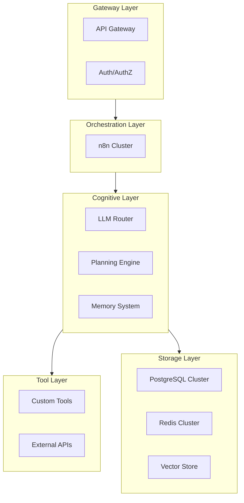

# Arquitectura del Sistema Unificada - RiccoAgency

## 1. Visión General de la Arquitectura

Nuestra arquitectura está diseñada bajo el framework **JARVIS (Just A Rather Very Intelligent System)**, un sistema propietario para construir agentes de IA y soluciones de automatización utilizando **n8n** como orquestador central. La arquitectura es modular, escalable y segura, permitiendo desde asistentes personales hasta complejas implementaciones empresariales.

## 2. Stack Tecnológico Principal

| Capa | Tecnología Primaria | Alternativas / Producción |
| :--- | :--- | :--- |
| **Orquestación** | n8n (Community Edition) | n8n (Enterprise Edition), Kubernetes |
| **IA & LLMs** | OpenAI GPT-4 / Claude 3 | Modelos locales, Fine-tuning |
| **Bases de Datos** | PostgreSQL, Redis | Cluster de Alta Disponibilidad (HA) |
| **Vector Store** | Chroma (desarrollo) | Qdrant (producción) |
| **Infraestructura** | Docker Compose | Kubernetes (AKS en Azure, EKS en AWS) |
| **CI/CD** | GitHub Actions | ArgoCD |
| **Monitorización** | Prometheus, Grafana | ELK Stack, OpenTelemetry |

## 3. Arquitectura de Componentes (Capas Lógicas)

Nuestra arquitectura se divide en capas lógicas que aseguran la separación de responsabilidades y la escalabilidad.

*   **Gateway Layer**: Punto de entrada para todas las solicitudes. Gestiona la autenticación, autorización y el enrutamiento.
*   **Orchestration Layer**: El corazón del sistema, donde los clusters de **n8n** ejecutan los workflows.
*   **Cognitive Layer**: El cerebro de IA. Gestiona la selección de modelos (LLM Router), la descomposición de tareas (Planner) y la memoria a corto y largo plazo.
*   **Tool Layer**: Conjunto de herramientas que los agentes pueden utilizar, incluyendo APIs externas y lógica de negocio personalizada.
*   **Storage Layer**: Persistencia de datos, incluyendo bases de datos operacionales, vectoriales y caché.

## 4. Despliegue y Operaciones (DevOps)

### Entornos
*   **Desarrollo**: Se utiliza `docker-compose` para un levantamiento rápido y sencillo de todo el stack (n8n, Postgres, Redis, Qdrant).
*   **Staging**: Un cluster de Kubernetes (K3s o similar) que replica la configuración de producción a menor escala.
*   **Producción**: Un cluster de Kubernetes de alta disponibilidad (AKS en Azure o EKS en AWS), con múltiples réplicas para cada servicio crítico.

### CI/CD
Utilizamos un pipeline de GitHub Actions que automatiza el proceso desde el `commit` hasta el despliegue, incluyendo:
1.  **Build**: Construcción de imágenes de Docker.
2.  **Test**: Ejecución de pruebas unitarias y de integración.
3.  **Security Scan**: Análisis de vulnerabilidades con Snyk y SonarQube.
4.  **Deploy**: Despliegue en los diferentes entornos utilizando Helm y ArgoCD.

## 5. Seguridad y Cumplimiento

La seguridad es un pilar fundamental de nuestra arquitectura.
*   **Autenticación y Autorización**: OAuth2/OIDC con MFA obligatorio y un modelo de acceso basado en roles (RBAC).
*   **Protección de Datos**: Cifrado de datos en tránsito (TLS) y en reposo. Los secretos se gestionan a través de Azure Key Vault o HashiCorp Vault.
*   **Cumplimiento**: La arquitectura está alineada con los estándares GDPR, SOC2 y está preparada para la certificación ISO 27001.

## 6. Alta Disponibilidad y Recuperación ante Desastres

*   **Alta Disponibilidad (HA)**:
    *   **n8n**: Cluster de workers detrás de un balanceador de carga.
    *   **PostgreSQL**: Cluster con un nodo primario y múltiples réplicas con failover automático.
    *   **Redis**: Cluster con configuración Master-Slave y monitorización Sentinel.
*   **Recuperación ante Desastres (DR)**:
    *   **Backups**: Snapshots diarios de la base de datos y exportaciones de workflows, almacenados en una región geográfica diferente.
    *   **Objetivos**: RTO (Tiempo de Recuperación) de 4 horas y RPO (Punto de Recuperación) de 15 minutos.

## 7. Observabilidad
*   **Métricas**: Prometheus y Grafana para monitorizar la salud del sistema (CPU, memoria, latencia) y KPIs de negocio (workflows completados, errores).
*   **Logs**: Centralización de logs con el stack ELK (Elasticsearch, Logstash, Kibana) o Loki para facilitar la búsqueda y el análisis.
*   **Tracing**: OpenTelemetry y Jaeger para trazar el flujo de una solicitud a través de los diferentes servicios y workflows.
