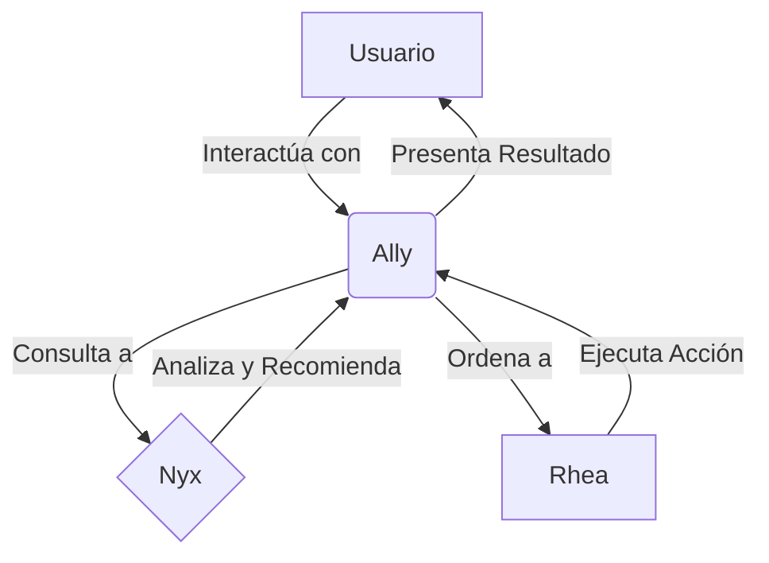

# El Panteón de la IA: Ally, Nyx y Rhea

Nuestra arquitectura de software se personifica en un ecosistema de agentes de IA interconectados, al que llamamos "El Panteón". Cada agente tiene un rol y una especialización claros, trabajando en conjunto para potenciar el sistema **Janus** y ofrecer una experiencia de usuario proactiva e inteligente.

## Los Agentes Principales

### 1. Ally - La Interfaz Humana y Coach
**Rol**: La cara visible del sistema, el "JARVIS" con el que el usuario interactúa.
**Función**: Traduce la intención humana en acciones técnicas, presenta la información de forma contextual y actúa como coach personal.
**Tecnología**: Frontend (Tauri/React), Vercel AI SDK, APIs de comunicación.

### 2. Nyx - El Cerebro de IA
**Rol**: El motor central de procesamiento, análisis y lógica de IA.
**Función**: Procesa lenguaje natural, ejecuta modelos de machine learning, realiza análisis predictivos y monitoriza el mercado.
**Tecnología**: LangChain, APIs de LLMs (GPT-4o, Claude 3), Bases de Datos Vectoriales (Qdrant).

### 3. Rhea - La Orquestadora de Acciones
**Rol**: El motor de automatización y ejecución de flujos de trabajo.
**Función**: Conecta con APIs de terceros, automatiza tareas repetitivas y ejecuta las acciones decididas por el sistema.
**Tecnología**: n8n (auto-hospedado), Conectores personalizados.

## Interacción del Ecosistema

El flujo de trabajo típico sigue este patrón:

*   El **Usuario** interactúa con **Ally**.
*   **Ally** consulta a **Nyx** para entender, analizar y obtener recomendaciones.
*   Basado en la recomendación, **Ally** ordena a **Rhea** que ejecute una tarea o workflow.
*   **Rhea** completa la acción y reporta a **Ally**.
*   **Ally** presenta el resultado final al **Usuario**.

Este modelo separa la interfaz (Ally), la inteligencia (Nyx) y la acción (Rhea), creando un sistema robusto, coherente y escalable.
