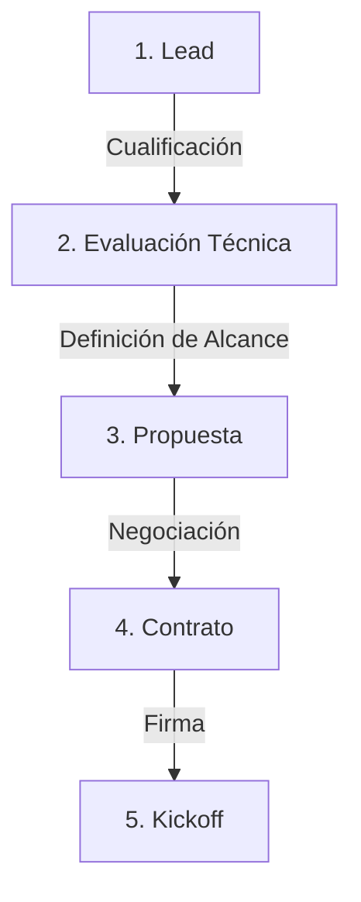
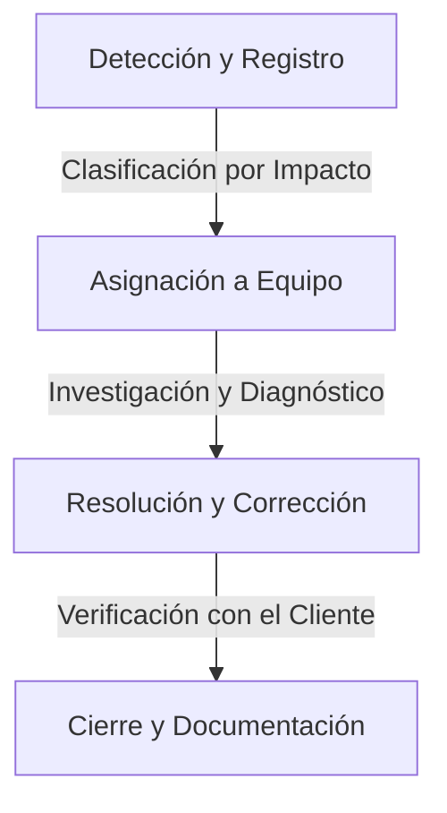

# Operaciones, Procesos y SLAs

Este documento unifica los procesos operacionales, el ciclo de vida de los proyectos y los Acuerdos de Nivel de Servicio (SLAs) que rigen la entrega y el soporte de nuestras soluciones.

## 1. Ciclo de Vida del Proyecto

Nuestro enfoque sigue un ciclo de vida claro y estructurado para garantizar la calidad y la alineación con las expectativas del cliente.

### Fase 1: Pre-Venta


### Fase 2: Implementación
```mermaid
graph TD
    A[1. Kickoff] -->|Configuración| B[2. Desarrollo]
    B -->|Validación| C[3. Pruebas (UAT)]
    C -->|Formación| D[4. Puesta en Marcha]
    D -->|Monitorización| E[5. Entrega y Soporte]
```

## 2. Procesos Operacionales Clave

### Proceso de Onboarding de Cliente
1.  **Reunión de Kick-off**: Presentación del equipo, revisión de objetivos y cronograma.
2.  **Configuración del Entorno**: Aprovisionamiento de infraestructura y accesos.
3.  **Revisión de Requisitos**: Validación de las especificaciones técnicas y de negocio.
4.  **Entrega del Plan de Proyecto**: Documento final con hitos, entregables y recursos.

### Proceso de Desarrollo (Agile)
1.  **Planificación del Sprint**: Revisión de historias, desglose de tareas y estimación.
2.  **Ciclo de Desarrollo**: Codificación, pruebas unitarias y documentación continua.
3.  **Revisión y Demo**: Revisión de código, pruebas de QA y demostración al cliente.
4.  **Despliegue**: Promoción a entornos de Staging, UAT y Producción.

## 3. Niveles de Soporte y SLAs

Ofrecemos tres niveles de soporte para adaptarnos a las necesidades de cada cliente.

| Nivel | Horario | Tiempo de Respuesta Inicial | Disponibilidad (Uptime) |
| :--- | :--- | :--- | :--- |
| **Basic** | L-V, 9:00-18:00 | Siguiente día hábil | 99.0% |
| **Professional** | L-V, 8:00-20:00 | Mismo día hábil | 99.9% |
| **Enterprise** | 24/7/365 | 1 hora | 99.99% |

### Tiempos de Resolución por Severidad (Plan Enterprise)

| Severidad | Descripción | Tiempo de Resolución Objetivo |
| :--- | :--- | :--- |
| **Crítica (P1)** | Sistema de producción inoperativo. | 4 horas |
| **Alta (P2)** | Funcionalidad crítica degradada. | 8 horas |
| **Media (P3)** | Funcionalidad no crítica afectada. | 24 horas |
| **Baja (P4)** | Consultas o problemas menores. | 48 horas |

*Nota: Los tiempos de resolución para otros planes se ajustan según el nivel de servicio.*

## 4. Proceso de Gestión de Incidentes



## 5. Herramientas Operacionales

*   **Gestión de Proyectos**: Jira, Confluence, GitHub Projects.
*   **Comunicación**: Slack (canal dedicado por cliente), Email, Videollamadas.
*   **Desarrollo**: VS Code, n8n, Git, Docker.

## 6. Mejora Continua

Implementamos un ciclo de feedback constante para mejorar nuestros procesos.
*   **Recopilación de Datos**: Métricas de rendimiento, encuestas de satisfacción (CSAT, NPS).
*   **Análisis**: Identificación de cuellos de botella y áreas de mejora.
*   **Implementación**: Actualización de procesos, herramientas y formación.
*   **Monitorización**: Evaluación del impacto de los cambios implementados.
