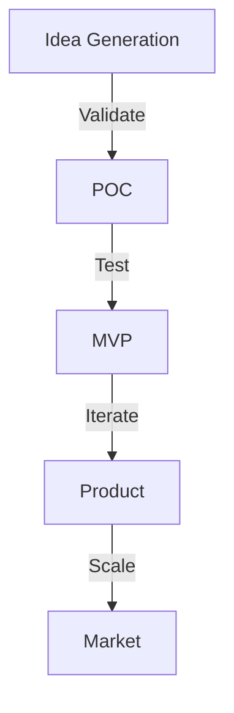

# Visión Estratégica RiccoAgency

## Misión

Transformar la forma en que las empresas operan a través de la automatización inteligente, combinando n8n y IA para crear soluciones que aumenten la productividad y generen valor medible.

## Visión 2025-2026

### Objetivos Core
```yaml
Tecnológicos:
  - Framework JARVIS production-ready
  - 50+ workflows n8n certificados
  - Integración avanzada con LLMs
  
Negocio:
  - 50+ clientes activos
  - Partner oficial n8n
  - Presencia internacional
  
Innovación:
  - R&D lab establecido
  - Custom AI models
  - Productos propios
```

### Pilares Estratégicos

1. **Excelencia Técnica**
   ```mermaid
   graph TD
       A[Expertise n8n] --> B[Framework JARVIS]
       B --> C[Custom Solutions]
       C --> D[Innovation Lab]
   ```

2. **Orientación a Valor**
   ```mermaid
   graph TD
       A[ROI Medible] --> B[KPIs Claros]
       B --> C[Mejora Continua]
       C --> D[Cliente Satisfecho]
   ```

3. **Innovación Responsable**
   ```mermaid
   graph TD
       A[IA Ética] --> B[Seguridad]
       B --> C[Compliance]
       C --> D[Sostenibilidad]
   ```

## Plan Estratégico

### Q4 2025 - Establecimiento
```yaml
Tecnología:
  - JARVIS v1.0 release
  - 10 workflows base
  - Infraestructura cloud

Mercado:
  - 5 clientes piloto
  - Branding y website
  - Marketing inicial

Operaciones:
  - Procesos base
  - Equipo core
  - Documentación
```

### Q1-Q2 2026 - Crecimiento
```yaml
Tecnología:
  - JARVIS Enterprise
  - 25+ workflows
  - Custom nodes

Mercado:
  - 20+ clientes
  - Partner program
  - Content marketing

Operaciones:
  - Equipo expandido
  - ISO 27001
  - Training program
```

### Q3-Q4 2026 - Escalada
```yaml
Tecnología:
  - Multi-tenant
  - Marketplace
  - AI platform

Mercado:
  - 50+ clientes
  - Internacional
  - Product-led

Operaciones:
  - Equipos globales
  - 24/7 support
  - Academy
```

## Modelo de Innovación

### 1. R&D Areas
```yaml
IA/ML:
  - LLM fine-tuning
  - Custom models
  - MLOps

Automation:
  - n8n patterns
  - Custom nodes
  - Integrations

Platform:
  - JARVIS core
  - Tools
  - APIs
```

### 2. Innovation Process


## Diferenciadores

### 1. Técnicos
```yaml
Expertise:
  - n8n advanced
  - IA/ML depth
  - Security focus

Framework:
  - JARVIS proven
  - Custom tools
  - Fast delivery
```

### 2. Metodológicos
```yaml
Approach:
  - Value first
  - Agile + DevOps
  - Knowledge transfer

Quality:
  - Best practices
  - Testing
  - Documentation
```

### 3. Comerciales
```yaml
Value:
  - ROI medible
  - Time-to-value
  - Escalabilidad

Support:
  - Proactive
  - Knowledge base
  - Community
```

## KPIs Estratégicos

### 1. Negocio
```yaml
Crecimiento:
  Revenue:
    2025: $500K
    2026: $2M
  
  Clientes:
    2025: 20
    2026: 50+
  
  ARR:
    2025: $300K
    2026: $1.5M
```

### 2. Operaciones
```yaml
Eficiencia:
  Delivery Time:
    Target: -20%
    Actual: TBD
  
  Customer Success:
    CSAT: >90%
    NPS: >50
  
  Quality:
    Bugs: <1%
    SLA: >99.9%
```

### 3. Innovación
```yaml
Métricas:
  New Features:
    2025: 50
    2026: 100
  
  Patents/IP:
    2025: 2
    2026: 5
  
  Research:
    Papers: 4
    POCs: 12
```

## Partner Ecosystem

### 1. Technology Partners
```yaml
Core:
  - n8n (official)
  - Cloud providers
  - AI/ML vendors

Integration:
  - CRM/ERP
  - Industry tools
  - APIs
```

### 2. Channel Partners
```yaml
Types:
  - Resellers
  - Consultants
  - Implementers

Markets:
  - Regional
  - Industry
  - Enterprise
```

## Sustainability

### 1. Business
```yaml
Financial:
  - Profitable growth
  - Healthy margins
  - Investment plans

Market:
  - Diversification
  - Innovation
  - Expansion
```

### 2. Environmental
```yaml
Green IT:
  - Energy efficient
  - Cloud optimization
  - Sustainable practices

Impact:
  - Carbon neutral
  - Waste reduction
  - Green policies
```

## Risk Management

### 1. Strategic Risks
```yaml
Market:
  - Competition
  - Technology changes
  - Economic factors

Mitigation:
  - Innovation
  - Diversification
  - Adaptability
```

### 2. Operational Risks
```yaml
Areas:
  - Technical debt
  - Resource constraints
  - Quality issues

Controls:
  - Monitoring
  - Training
  - Processes
```

## Próximos Pasos

### Inmediatos (30 días)
1. [ ] JARVIS v1.0 launch
2. [ ] First 5 clients
3. [ ] Core team complete

### Medio Plazo (90 días)
1. [ ] 15+ clients
2. [ ] Partner program
3. [ ] ISO 27001 prep

### Largo Plazo (180 días)
1. [ ] International
2. [ ] Product platform
3. [ ] Innovation lab