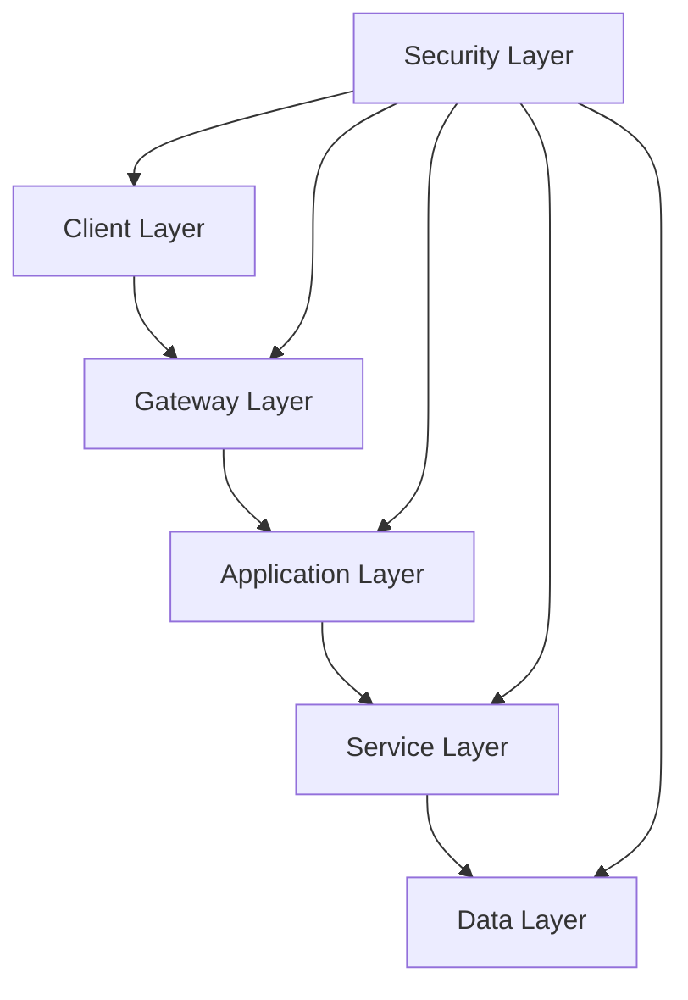
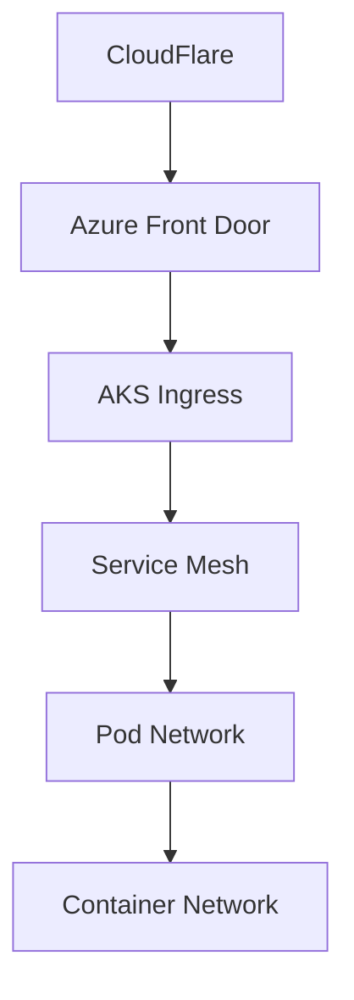

# Arquitectura Overview

## Visión General



## Capas Arquitectónicas

### 1. Client Layer
```yaml
Web:
  - React dashboard
  - Admin portal
  - Documentation

API:
  - REST endpoints
  - GraphQL
  - Webhooks

CLI:
  - Management tools
  - Local development
  - Deployment
```

### 2. Gateway Layer
```yaml
Components:
  - API Gateway
  - Load Balancer
  - Rate Limiter
  - WAF

Features:
  - Authentication
  - Request routing
  - Traffic control
  - Security
```

### 3. Application Layer
```yaml
n8n Platform:
  - Workflow engine
  - Custom nodes
  - Queue system
  - State management

JARVIS Framework:
  - Core services
  - Tool management
  - Memory system
  - Planning engine
```

### 4. Service Layer
```yaml
Core Services:
  - Authentication
  - Authorization
  - Monitoring
  - Logging

Business Services:
  - Workflow management
  - User management
  - Billing
  - Analytics
```

### 5. Data Layer
```yaml
Operational:
  Type: PostgreSQL
  Use: ACID transactions
  Mode: HA Cluster

Cache:
  Type: Redis
  Use: Sessions, queues
  Mode: Cluster

Vector:
  Type: Qdrant
  Use: Semantic search
  Mode: Distributed
```

## Infrastructure

### 1. Cloud Architecture
```yaml
Primary: Azure
Components:
  - AKS (Kubernetes)
  - Azure Database
  - Azure Cache
  - Azure Storage
  - Front Door
  - Key Vault

Secondary: AWS
Components:
  - EKS
  - RDS
  - ElastiCache
  - S3
  - CloudFront
  - KMS
```

### 2. Network Architecture


### 3. Security Architecture
```yaml
Perimeter:
  - WAF
  - DDoS protection
  - IP filtering

Application:
  - Authentication
  - Authorization
  - Encryption

Data:
  - Encryption at rest
  - TLS in transit
  - Key management
```

## High Availability

### 1. Infrastructure HA
```yaml
Kubernetes:
  - Multi-node clusters
  - Auto-scaling
  - Self-healing

Database:
  - Primary-replica
  - Automated failover
  - Backup strategy

Cache:
  - Redis cluster
  - Sentinel monitoring
  - Persistence
```

### 2. Application HA
```yaml
n8n:
  - Multiple workers
  - Queue system
  - State management

Services:
  - Load balanced
  - Health checks
  - Circuit breakers

Storage:
  - Replicated
  - Geo-redundant
  - Backup/restore
```

## Deployment Model

### 1. Development
```yaml
Environment:
  - Docker Compose
  - Local K3s
  - Dev tools

Components:
  - n8n
  - Postgres
  - Redis
  - Qdrant
```

### 2. Staging
```yaml
Environment:
  - AKS cluster
  - Monitoring
  - Test data

Features:
  - CI/CD
  - Testing
  - Security scans
```

### 3. Production
```yaml
Environment:
  - Multi-AZ
  - HA setup
  - DR plan

Features:
  - Auto-scaling
  - Monitoring
  - Backup
```

## Security Framework

### 1. Authentication
```yaml
Methods:
  - OAuth2/OIDC
  - API keys
  - Client certs

MFA:
  - Time-based OTP
  - Hardware keys
  - Biometric
```

### 2. Authorization
```yaml
Model:
  - RBAC
  - ABAC
  - Policy engine

Scope:
  - Resource level
  - Action level
  - Data level
```

### 3. Data Protection
```yaml
Encryption:
  - AES-256
  - RSA-2048
  - TLS 1.3

Keys:
  - Azure Key Vault
  - Rotation policy
  - Access control
```

## Monitoring & Observability

### 1. Metrics
```yaml
Infrastructure:
  - CPU/Memory
  - Network
  - Storage

Application:
  - Latency
  - Throughput
  - Error rates

Business:
  - Usage
  - Performance
  - Costs
```

### 2. Logging
```yaml
Stack:
  - Elasticsearch
  - Logstash
  - Kibana

Features:
  - Centralized
  - Searchable
  - Alerting
```

### 3. Tracing
```yaml
Platform:
  - OpenTelemetry
  - Jaeger

Coverage:
  - Request flow
  - Dependencies
  - Performance
```

## Disaster Recovery

### 1. Backup Strategy
```yaml
Types:
  - Full system
  - Incremental
  - Point-in-time

Storage:
  - Geo-redundant
  - Encrypted
  - Versioned
```

### 2. Recovery Plan
```yaml
RTO: 4 hours
RPO: 15 minutes

Steps:
  - Detection
  - Assessment
  - Recovery
  - Verification
```

## Cost Optimization

### 1. Infrastructure
```yaml
Strategies:
  - Right-sizing
  - Auto-scaling
  - Spot instances

Monitoring:
  - Usage metrics
  - Cost alerts
  - Optimization
```

### 2. Application
```yaml
Optimization:
  - Cache usage
  - Resource limits
  - Batch processing

Efficiency:
  - Performance
  - Scalability
  - Automation
```

## Roadmap

### Q4 2025
1. Base Infrastructure
   - Cloud setup
   - CI/CD pipeline
   - Monitoring

### Q1 2026
1. Scale Out
   - Multi-region
   - HA setup
   - DR testing

### Q2 2026
1. Enterprise Grade
   - Custom solutions
   - Advanced security
   - Full compliance