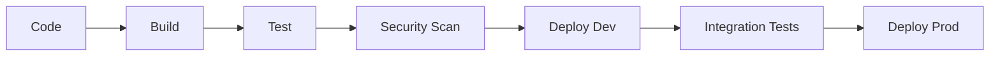

# Stack Técnico Detallado

## Infraestructura

### Cloud Providers
- Azure (principal)
- AWS (backup)
- Digital Ocean (dev/test)

### Orquestación
- Kubernetes (AKS/EKS)
- Docker Compose (dev)
- Helm charts

### Networking
- Ingress NGINX
- Azure Front Door
- Cert-manager
- Private VNet

## Servicios Core

### n8n Platform
- Enterprise Edition
- Custom nodes
- Webhook management
- Credential vault

### Bases de Datos
- PostgreSQL (operacional, HA)
- Redis (cache, sesiones, colas)
- Qdrant (vectorial, semantic search)

### Mensajería
- Redis Streams (rápido)
- Apache Kafka (heavy workloads)

## Herramientas DevOps
- GitHub Actions (CI/CD)
- ArgoCD (K8s deploy)
- Terraform (infra as code)
- Ansible (configuración)

## Seguridad
- Azure AD B2C / Auth0 (SSO, MFA)
- HashiCorp Vault / Azure Key Vault (secrets)
- SonarQube / Snyk (scanning)
- RBAC, audit logging

## Observabilidad
- Prometheus + Grafana (metrics)
- ELK Stack (logs)
- OpenTelemetry + Jaeger (tracing)

## Desarrollo Local
- Docker Desktop
- VS Code
- Git
- K3s / Minikube (opcional)

## CI/CD Pipeline

## Backup & Recovery
- DB: daily full, hourly incremental, 30d retention
- Workflows: daily export, git backup
- Storage: Azure Blob, S3

## Cost Optimization
- Autoscaling
- Spot instances
- Resource limits
- Cost alerts

## Roadmap Técnico
- Q4 2025: Infra base, monitoring, CI/CD
- Q1 2026: K8s prod, HA DB, security
- Q2 2026: Multi-region, advanced monitoring
- Q3-Q4 2026: Compliance, custom tooling