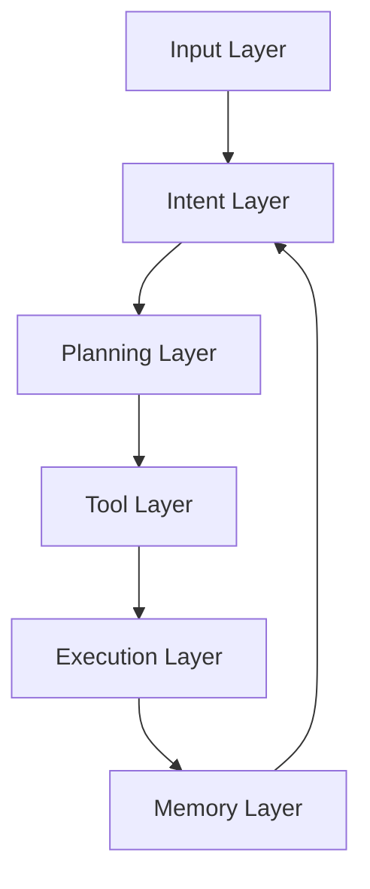

# Framework JARVIS

## Visión General

JARVIS (Just A Rather Very Intelligent System) es nuestro framework de automatización que combina n8n, LLMs y herramientas especializadas para crear agentes IA autónomos y semi-autónomos.

## Arquitectura Core



### 1. Input Layer
```yaml
Components:
  - Webhook handlers
  - Event listeners
  - Stream processors
  - Voice interface
  
Protocols:
  - HTTP/HTTPS
  - WebSocket
  - MQTT
  - gRPC
```

### 2. Intent Layer
```yaml
Components:
  - Intent classifier
  - Context extractor
  - Entity recognition
  - Sentiment analysis
  
Models:
  - GPT-4
  - Claude 3
  - Custom models
```

### 3. Planning Layer
```yaml
Components:
  - Goal decomposition
  - Task planning
  - Resource allocation
  - Dependency resolution
  
Strategies:
  - Hierarchical planning
  - Dynamic replanning
  - Multi-agent coordination
```

### 4. Tool Layer
```yaml
Categories:
  Core Tools:
    - File operations
    - API calls
    - Database ops
    - Messaging
    
  Custom Tools:
    - Business logic
    - Domain tools
    - Integrations
    
  AI Tools:
    - LLM calls
    - Vision processing
    - Speech processing
```

### 5. Execution Layer
```yaml
Components:
  - Workflow engine
  - Error handling
  - Retry logic
  - Monitoring
  
Features:
  - Parallel execution
  - Rate limiting
  - Circuit breakers
  - Logging
```

### 6. Memory Layer
```yaml
Types:
  Short-term:
    - Redis
    - Session data
    - Context window
    
  Long-term:
    - Vector DB
    - Knowledge base
    - Learning patterns
    
  Episodic:
    - PostgreSQL
    - Interaction history
    - Audit logs
```

## Implementación n8n

### 1. Base Workflow
```typescript
// Base JARVIS workflow structure
{
  "nodes": [
    {
      "type": "webhook",
      "name": "Input Handler",
      "parameters": {
        "path": "/jarvis/{{agent_id}}",
        "authentication": true
      }
    },
    {
      "type": "function",
      "name": "Intent Classifier",
      "code": `
        // Intent classification logic
        return {
          intent: classifyIntent(input),
          confidence: getConfidence(),
          entities: extractEntities()
        };
      `
    },
    {
      "type": "llm",
      "name": "Planner",
      "parameters": {
        "model": "gpt-4",
        "temperature": 0.2
      }
    }
  ]
}
```

### 2. Memory Management
```typescript
// Memory operations
class JARVISMemory {
  async store(data: any) {
    // Short-term
    await redis.set(key, data, 'EX', 3600);
    
    // Long-term
    if (isRelevant(data)) {
      await vectorDB.insert(embed(data));
    }
    
    // Episodic
    await postgres.insert({
      timestamp: Date.now(),
      type: data.type,
      content: data
    });
  }
  
  async retrieve(context: any) {
    const recent = await redis.get(context.key);
    const relevant = await vectorDB.search(embed(context));
    return mergeResults(recent, relevant);
  }
}
```

### 3. Tool Integration
```typescript
// Tool wrapper
class JARVISTool {
  async execute(params: any) {
    // Pre-execution
    this.validate(params);
    this.logAttempt(params);
    
    try {
      // Execution
      const result = await this.tool.run(params);
      
      // Post-execution
      await this.memory.store(result);
      this.logSuccess(result);
      
      return result;
    } catch (error) {
      await this.handleError(error);
    }
  }
}
```

## Patrones de Diseño

### 1. Event Processing
```yaml
Pattern: Event-Driven Architecture
Components:
  - Event emitters
  - Event handlers
  - Event bus
  
Implementation:
  - Redis Streams
  - Apache Kafka
  - RabbitMQ
```

### 2. Error Handling
```yaml
Strategies:
  - Retry with backoff
  - Circuit breaker
  - Fallback options
  - Dead letter queue
  
Monitoring:
  - Error tracking
  - Alert system
  - Recovery metrics
```

### 3. State Management
```yaml
Approaches:
  - Event sourcing
  - CQRS
  - Saga pattern
  
Storage:
  - Redis (state)
  - PostgreSQL (events)
  - Vector DB (context)
```

## Security

### 1. Authentication
```yaml
Methods:
  - OAuth2
  - API keys
  - JWT
  
Features:
  - Role-based access
  - Scope control
  - Audit logging
```

### 2. Data Protection
```yaml
Measures:
  - Encryption at rest
  - TLS in transit
  - Data masking
  
Compliance:
  - GDPR
  - SOC2
  - ISO27001
```

## Observability

### 1. Logging
```yaml
Levels:
  - DEBUG: Development
  - INFO: Operations
  - WARN: Issues
  - ERROR: Problems
  
Storage:
  - ELK Stack
  - Loki
  - CloudWatch
```

### 2. Metrics
```yaml
Categories:
  System:
    - CPU/Memory
    - Latency
    - Error rates
    
  Business:
    - Task completion
    - Success rates
    - Cost metrics
```

### 3. Tracing
```yaml
Implementation:
  - OpenTelemetry
  - Jaeger
  - Custom spans
  
Features:
  - Request tracking
  - Error tracing
  - Performance analysis
```

## Development Guide

### 1. Setup
```bash
# Local development
git clone <repo>
cd jarvis-framework
npm install

# Environment
cp .env.example .env
# Edit .env with your settings

# Run
docker-compose up -d
npm run dev
```

### 2. Testing
```yaml
Levels:
  Unit:
    - Components
    - Functions
    - Tools
    
  Integration:
    - Workflows
    - Memory
    - Tools
    
  E2E:
    - Full agents
    - User scenarios
    - Load tests
```

### 3. Deployment
```yaml
Environments:
  Development:
    - Local Docker
    - Basic monitoring
    - Fast iteration
    
  Staging:
    - K8s cluster
    - Full monitoring
    - Test data
    
  Production:
    - HA setup
    - Full security
    - Real data
```

## Roadmap

### Q4 2025
1. Core Framework
   - Base architecture
   - Essential tools
   - Memory system

### Q1 2026
1. Advanced Features
   - Multi-agent
   - Learning system
   - Tool marketplace

### Q2 2026
1. Enterprise
   - HA setup
   - Advanced security
   - Custom solutions