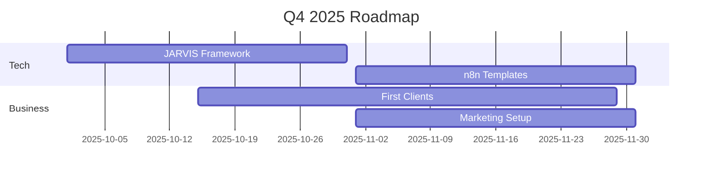
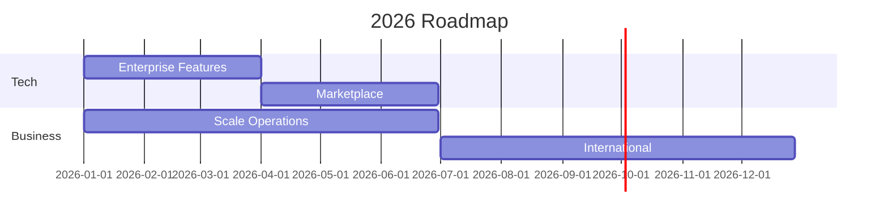

# Visión General RiccoAgency

## Misión

Transformar la forma en que las empresas operan a través de la automatización inteligente y agentes IA, utilizando n8n como columna vertebral para crear soluciones escalables y mantenibles.

## Objetivos Estratégicos 2025-2026

### Q4 2025
1. **Lanzamiento Tecnológico**
   - Framework JARVIS v1.0
   - 5 workflows base en n8n
   - Infraestructura cloud

2. **Mercado**
   - 3 clientes piloto
   - Website y branding
   - Presencia LinkedIn/Twitter

3. **Operaciones**
   - Procesos documentados
   - SLAs definidos
   - Templates base

### Q1-Q2 2026
1. **Expansión Producto**
   - JARVIS Enterprise
   - 20+ workflows
   - Marketplace inicio

2. **Crecimiento**
   - 15 clientes activos
   - Partner n8n oficial
   - Equipo 10 personas

3. **Automatización**
   - Internal JARVIS
   - Sales automation
   - Support system

### Q3-Q4 2026
1. **Escalabilidad**
   - Multi-tenant
   - White label
   - API platform

2. **Mercado**
   - 50+ clientes
   - Internacional
   - Channel partners

3. **Innovación**
   - R&D lab
   - AI models
   - New verticals

## Modelo de Negocio

### Revenue Streams
1. **Implementación (60%)**
   ```yaml
   Setup: 20%
   Development: 50%
   Training: 30%
   ```

2. **Recurring (30%)**
   ```yaml
   Support: 40%
   Hosting: 30%
   Updates: 30%
   ```

3. **Productos (10%)**
   ```yaml
   Templates: 40%
   Add-ons: 40%
   Training: 20%
   ```

### Cost Structure
1. **Fixed (60%)**
   - Team core
   - Infrastructure
   - Tools/licenses

2. **Variable (40%)**
   - Contractors
   - Cloud costs
   - Commission

## Diferenciadores

### 1. Expertise Técnico
- n8n advanced patterns
- LLM integration
- Custom nodes

### 2. Framework JARVIS
- Modular design
- Proven architecture
- Fast deployment

### 3. Metodología
- Agile + DevOps
- Documentation first
- Knowledge transfer

## Métricas Clave

### Business
```yaml
CAC (Customer Acquisition Cost):
  Target: $5,000
  Actual: TBD

LTV (Lifetime Value):
  Target: $50,000
  Actual: TBD

Churn Rate:
  Target: <5%
  Actual: TBD
```

### Technical
```yaml
SLA Compliance:
  Target: 99.9%
  Actual: TBD

Time to Deploy:
  Target: <2 weeks
  Actual: TBD

Bug Rate:
  Target: <1%
  Actual: TBD
```

## Roadmap 2025-2026

### Q4 2025


### 2026


## Próximos Pasos

### Inmediatos (30 días)
1. [ ] Completar JARVIS core
2. [ ] Setup infra base
3. [ ] First client setup

### Corto Plazo (90 días)
1. [ ] Expand templates
2. [ ] Hire key roles
3. [ ] Marketing presence

### Medio Plazo (180 días)
1. [ ] Enterprise features
2. [ ] Partner program
3. [ ] Scale operations