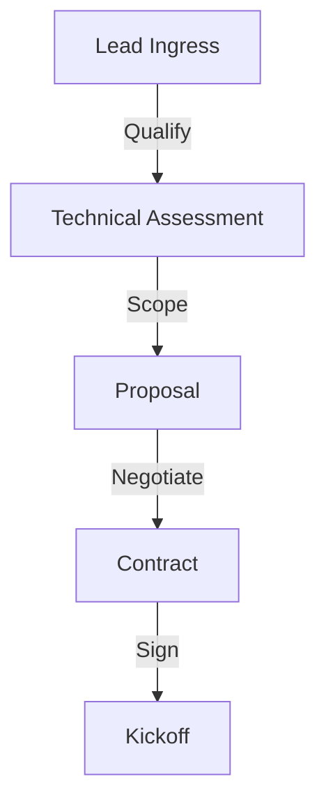
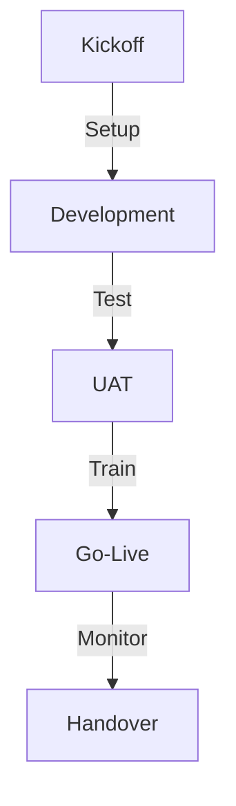
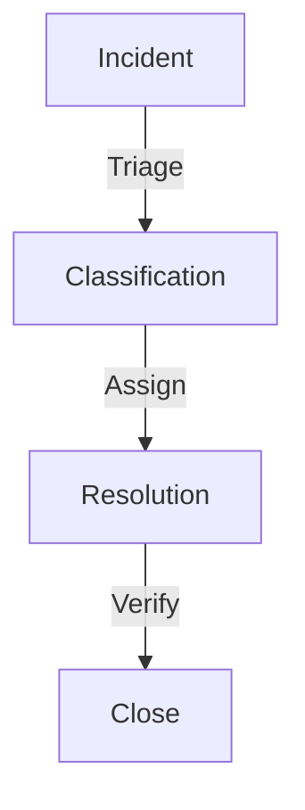
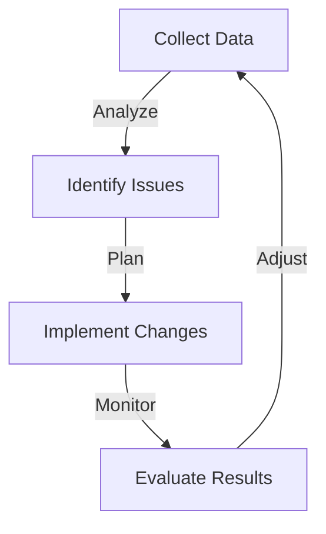

# Procesos Operacionales

## Ciclo de Vida del Proyecto

### 1. Pre-Venta


### 2. Implementación


### 3. Soporte


## Procesos Detallados

### 1. Onboarding
```yaml
Steps:
  1. Kick-off Meeting:
     - Project overview
     - Team intro
     - Timeline review
     
  2. Environment Setup:
     - Infrastructure
     - Access rights
     - Initial config
     
  3. Requirements Review:
     - Business needs
     - Technical specs
     - Success criteria
     
  4. Project Plan:
     - Timeline
     - Milestones
     - Resources
```

### 2. Development
```yaml
Workflow:
  1. Sprint Planning:
     - Story review
     - Task breakdown
     - Estimation
     
  2. Development:
     - Coding
     - Testing
     - Documentation
     
  3. Review:
     - Code review
     - QA testing
     - Client demo
     
  4. Deploy:
     - Staging
     - UAT
     - Production
```

### 3. Support
```yaml
Levels:
  L1:
    - Basic issues
    - Quick fixes
    - User guidance
    
  L2:
    - Technical issues
    - Configuration
    - Performance
    
  L3:
    - Complex problems
    - Custom development
    - Architecture
```

## Templates Operacionales

### 1. Project Documents
```yaml
Required:
  - Project charter
  - Requirements doc
  - Technical spec
  - Test plan
  
Optional:
  - Training plan
  - Rollback plan
  - Migration guide
```

### 2. Workflows
```yaml
Categories:
  Standard:
    - Lead processing
    - Document handling
    - Notifications
    
  Custom:
    - Industry specific
    - Client custom
    - Integration
```

### 3. Reports
```yaml
Types:
  Daily:
    - System status
    - Incidents
    - Performance
    
  Weekly:
    - Progress
    - Issues
    - Planning
    
  Monthly:
    - KPIs
    - Review
    - Planning
```

## Herramientas Operacionales

### 1. Project Management
```yaml
Tools:
  - Jira
  - Confluence
  - GitHub Projects
  
Templates:
  - Sprint board
  - Roadmap
  - Reports
```

### 2. Communication
```yaml
Channels:
  - Slack
  - Email
  - Video calls
  
Guidelines:
  - Response times
  - Escalation
  - Documentation
```

### 3. Development
```yaml
Environment:
  - VS Code
  - n8n
  - Git
  
Process:
  - Branch strategy
  - Review process
  - Deploy pipeline
```

## Métricas y KPIs

### 1. Project Metrics
```yaml
Delivery:
  - On-time delivery
  - Budget adherence
  - Scope compliance
  
Quality:
  - Bug rate
  - Test coverage
  - Documentation
```

### 2. Support Metrics
```yaml
Response:
  - Time to respond
  - Time to resolve
  - First-call resolution
  
Quality:
  - Customer satisfaction
  - SLA compliance
  - Reopen rate
```

### 3. Business Metrics
```yaml
Financial:
  - Project margin
  - Resource utilization
  - Revenue growth
  
Customer:
  - Satisfaction
  - Retention
  - Referrals
```

## Gestión de Riesgos

### 1. Identificación
```yaml
Categories:
  Technical:
    - Integration issues
    - Performance problems
    - Security vulnerabilities
    
  Business:
    - Resource availability
    - Scope creep
    - Budget overrun
```

### 2. Mitigación
```yaml
Strategies:
  Prevention:
    - Planning
    - Testing
    - Training
    
  Response:
    - Escalation
    - Communication
    - Resolution
```

## Mejora Continua

### 1. Feedback Loop


### 2. Knowledge Base
```yaml
Components:
  - Best practices
  - Lessons learned
  - Templates
  - Solutions
```

## Checklist Operacional

### 1. Proyecto Nuevo
```yaml
Setup:
  - [ ] Environment ready
  - [ ] Access granted
  - [ ] Tools configured
  
Planning:
  - [ ] Requirements documented
  - [ ] Timeline agreed
  - [ ] Resources assigned
```

### 2. Go-Live
```yaml
Pre-launch:
  - [ ] Testing complete
  - [ ] Documentation ready
  - [ ] Training done
  
Launch:
  - [ ] Deployment plan
  - [ ] Rollback plan
  - [ ] Support ready
```

### 3. Soporte
```yaml
Daily:
  - [ ] System check
  - [ ] Incident review
  - [ ] Performance monitor
  
Weekly:
  - [ ] Status report
  - [ ] Resource planning
  - [ ] Client update
```

## Plan de Contingencia

### 1. Incident Response
```yaml
Steps:
  1. Detection
  2. Classification
  3. Response
  4. Resolution
  5. Review
```

### 2. Business Continuity
```yaml
Components:
  - Backup systems
  - Communication plan
  - Recovery procedures
```

## Roadmap Operacional

### Q4 2025
1. Base Setup
   - Process documentation
   - Tool implementation
   - Team training

### Q1 2026
1. Optimization
   - Automation
   - Templates
   - Metrics

### Q2 2026
1. Scale
   - Team growth
   - Process refinement
   - Tool enhancement