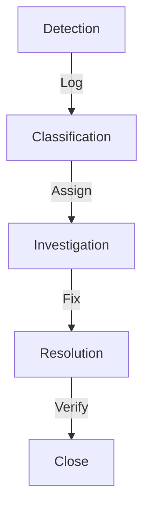

# SLAs y Niveles de Servicio

## Niveles de Servicio

### 1. Basic Support
```yaml
Horario:
  L-V: 9:00-18:00
  Respuesta: Next business day
  Cobertura: Bugs only
  
Precio:
  Incluido en implementación
  30 días post-launch
```

### 2. Professional Support
```yaml
Horario:
  L-V: 8:00-20:00
  Respuesta: Same business day
  Cobertura: Full
  
Precio:
  10% anual del proyecto
  Mínimo $500/mes
```

### 3. Enterprise Support
```yaml
Horario:
  24/7/365
  Respuesta: 1 hora
  Cobertura: Full + Priority
  
Precio:
  20% anual del proyecto
  Mínimo $2,000/mes
```

## Tiempos de Respuesta

### 1. Por Severidad
```yaml
Critical (P1):
  Response: 1 hora
  Update: 2 horas
  Resolution: 4 horas
  
High (P2):
  Response: 2 horas
  Update: 4 horas
  Resolution: 8 horas
  
Medium (P3):
  Response: 4 horas
  Update: 8 horas
  Resolution: 24 horas
  
Low (P4):
  Response: 8 horas
  Update: 24 horas
  Resolution: 48 horas
```

### 2. Por Plan
```yaml
Basic:
  P1: Next day
  P2: 2 days
  P3: 3 days
  P4: 5 days
  
Professional:
  P1: 2 horas
  P2: 4 horas
  P3: 8 horas
  P4: 24 horas
  
Enterprise:
  P1: 1 hora
  P2: 2 horas
  P3: 4 horas
  P4: 8 horas
```

## Disponibilidad del Servicio

### 1. Infrastructure SLA
```yaml
Basic:
  Uptime: 99.0%
  Downtime permitido: 7.31 horas/mes
  
Professional:
  Uptime: 99.9%
  Downtime permitido: 43.8 minutos/mes
  
Enterprise:
  Uptime: 99.99%
  Downtime permitido: 4.38 minutos/mes
```

### 2. Mantenimiento
```yaml
Programado:
  Frecuencia: Mensual
  Duración: 2-4 horas
  Notificación: 1 semana
  
Emergency:
  Según necesidad
  Duración: Variable
  Notificación: ASAP
```

## Métricas y Reporting

### 1. System Metrics
```yaml
Performance:
  - API response time
  - Workflow execution
  - Error rate
  
Availability:
  - Uptime
  - MTTR
  - MTBF
```

### 2. Support Metrics
```yaml
Response:
  - Time to first response
  - Time to resolution
  - SLA compliance
  
Quality:
  - First contact resolution
  - Customer satisfaction
  - Reopen rate
```

### 3. Business Metrics
```yaml
Operational:
  - Resource utilization
  - Cost per ticket
  - Automation rate
  
Customer:
  - Satisfaction score
  - NPS
  - Retention rate
```

## Proceso de Soporte

### 1. Incident Management


### 2. Problem Management
```yaml
Steps:
  1. Identification
  2. Investigation
  3. Root Cause
  4. Solution
  5. Prevention
```

### 3. Change Management
```yaml
Process:
  1. Request
  2. Evaluate
  3. Approve
  4. Schedule
  5. Implement
```

## Penalties y Compensación

### 1. SLA Breach
```yaml
Level 1:
  Trigger: <98% compliance
  Credit: 10% monthly fee
  
Level 2:
  Trigger: <95% compliance
  Credit: 25% monthly fee
  
Level 3:
  Trigger: <90% compliance
  Credit: 50% monthly fee
```

### 2. Critical Incidents
```yaml
Definition:
  - Production down
  - Data loss risk
  - Security breach
  
Compensation:
  - Service credits
  - Extended support
  - Free consulting
```

## Escalation Matrix

### 1. Technical
```yaml
Level 1:
  - Support Engineer
  - Response: 15 min
  
Level 2:
  - Technical Lead
  - Response: 30 min
  
Level 3:
  - CTO
  - Response: 1 hora
```

### 2. Management
```yaml
Level 1:
  - Account Manager
  - Response: 2 horas
  
Level 2:
  - Service Director
  - Response: 4 horas
  
Level 3:
  - CEO
  - Response: 8 horas
```

## Communication Plan

### 1. Routine Updates
```yaml
Daily:
  - System status
  - Incident summary
  - Performance metrics
  
Weekly:
  - SLA compliance
  - Issue summary
  - Planning update
```

### 2. Incident Communication
```yaml
Initial:
  - What happened
  - Impact
  - Next steps
  
Updates:
  - Progress
  - ETA
  - Mitigation
  
Resolution:
  - Fix details
  - Prevention
  - Lessons learned
```

## Tools & Systems

### 1. Support Platform
```yaml
Components:
  - Ticket system
  - Knowledge base
  - Chat support
  - Phone system
```

### 2. Monitoring
```yaml
Systems:
  - Infrastructure
  - Applications
  - Security
  - Performance
```

## Continuous Improvement

### 1. Review Process
```yaml
Monthly:
  - SLA performance
  - Customer feedback
  - Team feedback
  
Quarterly:
  - Process review
  - Tool evaluation
  - Training needs
```

### 2. Action Items
```yaml
Improvement:
  - Process updates
  - Tool upgrades
  - Training programs
  
Documentation:
  - KB updates
  - Process docs
  - Templates
```

## Roadmap

### Q4 2025
1. Basic SLA
   - Support process
   - Metrics setup
   - Basic monitoring

### Q1 2026
1. Enhanced SLA
   - 24/7 support
   - Advanced monitoring
   - Automated reporting

### Q2 2026
1. Enterprise SLA
   - Global support
   - Custom SLAs
   - Premium features