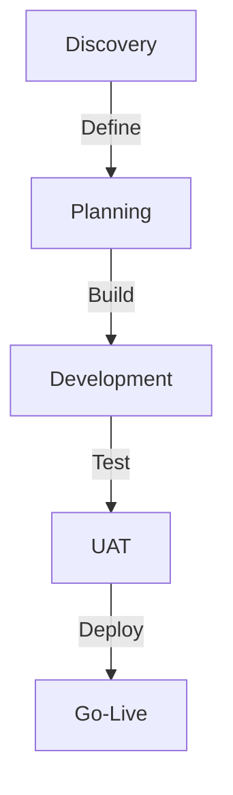

# Catálogo de Servicios

## JARVIS Implementations

### 1. JARVIS Personal (JARVIS-P)
```yaml
Description: Asistente personal inteligente con automatización de tareas diarias

Features:
  - Calendar management
  - Email automation
  - Task tracking
  - Voice interface

Use Cases:
  - Personal productivity
  - Small business
  - Freelancers

Precio Base: $2,500
Timeline: 2-3 semanas
```

### 2. JARVIS Business (JARVIS-B)
```yaml
Description: Suite de automatización para procesos empresariales

Features:
  - CRM integration
  - Document processing
  - Team coordination
  - Analytics basics

Use Cases:
  - Sales teams
  - HR departments
  - Support teams

Precio Base: $5,000
Timeline: 3-4 semanas
```

### 3. JARVIS Enterprise (JARVIS-E)
```yaml
Description: Plataforma enterprise de automatización multi-departamental

Features:
  - Multi-department
  - Compliance
  - Custom integrations
  - Advanced analytics

Use Cases:
  - Large enterprises
  - Multi-location
  - Regulated industries

Precio Base: $15,000
Timeline: 8-12 semanas
```

## Servicios Profesionales

### 1. Consulting
```yaml
Types:
  Strategy:
    - Automation roadmap
    - Process assessment
    - Technology planning
    Price: $200/hora
    
  Technical:
    - Architecture review
    - Performance optimization
    - Security audit
    Price: $250/hora
    
  Training:
    - Team workshops
    - Technical training
    - Best practices
    Price: $180/hora
```

### 2. Implementation
```yaml
Services:
  Basic:
    - Single workflow
    - Standard integrations
    - Basic training
    Price: from $2,500
    
  Advanced:
    - Multiple workflows
    - Custom integrations
    - Full training
    Price: from $5,000
    
  Enterprise:
    - Complex solutions
    - Multi-system
    - Enterprise training
    Price: from $15,000
```

### 3. Support
```yaml
Levels:
  Basic:
    - Business hours
    - Email support
    - Bug fixes
    Price: Included
    
  Professional:
    - Extended hours
    - Priority support
    - Enhancements
    Price: 10% annual
    
  Enterprise:
    - 24/7 support
    - Dedicated team
    - Custom SLA
    Price: 20% annual
```

## Productos

### 1. Templates
```yaml
Categories:
  Workflow Packs:
    - Email automation
    - Document processing
    - Social media
    Price: from $500
    
  Integration Packs:
    - CRM connectors
    - ERP connectors
    - API templates
    Price: from $1,000
    
  Industry Packs:
    - Healthcare
    - Finance
    - E-commerce
    Price: from $2,000
```

### 2. Add-ons
```yaml
Types:
  Tools:
    - Custom nodes
    - Analytics dashboard
    - Admin panel
    Price: from $500
    
  Integrations:
    - Custom APIs
    - Legacy systems
    - Third-party
    Price: from $1,000
    
  Features:
    - Advanced security
    - Custom reporting
    - White-label
    Price: from $2,000
```

## Paquetes Especiales

### 1. Startup Package
```yaml
Includes:
  - JARVIS-P base
  - 2 workflows
  - Basic support
  - Setup & training
  
Price: $4,500
Timeline: 4 weeks
```

### 2. Growth Package
```yaml
Includes:
  - JARVIS-B
  - 5 workflows
  - Professional support
  - Templates pack
  
Price: $12,000
Timeline: 8 weeks
```

### 3. Enterprise Package
```yaml
Includes:
  - JARVIS-E
  - Custom workflows
  - Enterprise support
  - Full training
  
Price: from $25,000
Timeline: 12+ weeks
```

## Industry Solutions

### 1. Healthcare
```yaml
Features:
  - HIPAA compliance
  - Patient workflows
  - Medical integrations
  
Components:
  - Document processing
  - Appointment system
  - Compliance tools
  
Price: from $20,000
```

### 2. Finance
```yaml
Features:
  - Regulatory compliance
  - Transaction processing
  - Risk management
  
Components:
  - Data security
  - Audit trails
  - Reporting suite
  
Price: from $25,000
```

### 3. E-commerce
```yaml
Features:
  - Order processing
  - Inventory sync
  - Customer service
  
Components:
  - Shop integration
  - Payment processing
  - Fulfillment automation
  
Price: from $15,000
```

## Service Delivery

### 1. Implementation Process


### 2. Support Process
```yaml
Levels:
  L1:
    - Initial response
    - Basic issues
    - User support
    
  L2:
    - Technical issues
    - Configuration
    - Optimization
    
  L3:
    - Complex problems
    - Custom development
    - Architecture
```

## Garantías y SLAs

### 1. Implementation
```yaml
Guarantees:
  - On-time delivery
  - Budget adherence
  - Quality standards
  
Support:
  - 30-day warranty
  - Bug fixes
  - Documentation
```

### 2. Ongoing Service
```yaml
Availability:
  Basic: 99.0%
  Pro: 99.9%
  Enterprise: 99.99%
  
Response:
  Basic: Next day
  Pro: Same day
  Enterprise: 1 hour
```

## Próximos Productos

### Q4 2025
1. JARVIS Templates
   - Industry packs
   - Workflow library
   - Integration templates

### Q1 2026
1. JARVIS Platform
   - Multi-tenant
   - Marketplace
   - Developer tools

### Q2 2026
1. JARVIS Enterprise+
   - Global scale
   - Custom solutions
   - Advanced AI