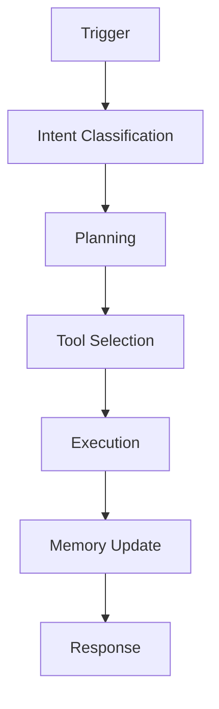

# Arquitectura JARVIS

## Overview

JARVIS (Just A Rather Very Intelligent System) es nuestro framework propietario para crear agentes IA utilizando n8n como orquestador principal. Esta arquitectura permite crear desde asistentes personales hasta sistemas empresariales completos.

## Componentes Core

### 1. Orquestación (n8n)


### 2. Cognitive Layer
```yaml
Components:
  LLM Router:
    - GPT-4
    - Claude 3
    - Local LLMs
  
  Planner:
    - Task decomposition
    - Tool selection
    - Goal tracking
  
  Memory:
    - Short-term (Redis)
    - Long-term (Vector DB)
    - Episodic (PostgreSQL)
```

### 3. Tool Layer
```yaml
Core Tools:
  - File operations
  - API calls
  - Database operations
  - Email/messaging
  - Calendar management

Custom Tools:
  - Business logic
  - Domain specific
  - Legacy integration
```

## Patrones de Diseño

### 1. Event Processing
```typescript
// n8n workflow pattern
{
  "nodes": [
    {
      "type": "webhook",
      "position": [100, 200]
    },
    {
      "type": "function",
      "position": [300, 200],
      "code": `
        // Intent classification
        return {
          intent: classifyIntent(input),
          confidence: calculateConfidence(),
          context: extractContext()
        };
      `
    },
    {
      "type": "switch",
      "position": [500, 200]
    }
  ]
}
```

### 2. Memory Management
```yaml
Pattern:
  Short-term:
    - Session data
    - Recent context
    - Temporary state
    
  Long-term:
    - Knowledge base
    - Historical data
    - Learned patterns
    
  Retrieval:
    - Semantic search
    - Time-based
    - Relevance scoring
```

### 3. Tool Integration
```typescript
// Tool wrapper pattern
class ToolWrapper {
  async execute(params) {
    try {
      // Pre-execution
      this.validate(params);
      this.logAttempt(params);
      
      // Execution
      const result = await this.tool.run(params);
      
      // Post-execution
      this.updateMemory(result);
      this.logSuccess(result);
      
      return result;
    } catch (error) {
      this.handleError(error);
    }
  }
}
```

## Implementaciones

### 1. JARVIS Personal
```yaml
Components:
  - Calendar management
  - Email processing
  - Task tracking
  - Voice interface

Workflows:
  - Daily planning
  - Email triage
  - Meeting prep
  - Task reminder
```

### 2. JARVIS Business
```yaml
Components:
  - CRM automation
  - Document processing
  - Team coordination
  - Analytics

Workflows:
  - Lead qualification
  - Document analysis
  - Team sync
  - Reporting
```

### 3. JARVIS Enterprise
```yaml
Components:
  - Multi-department
  - Compliance
  - Integration hub
  - Analytics suite

Workflows:
  - Process automation
  - Compliance checks
  - Data integration
  - Executive reports
```

## Seguridad

### 1. Authentication
```yaml
Methods:
  - OAuth2
  - API keys
  - JWT tokens
  
Policies:
  - Role-based access
  - Least privilege
  - Audit logging
```

### 2. Data Protection
```yaml
Measures:
  - Encryption at rest
  - TLS in transit
  - Data masking
  
Compliance:
  - GDPR
  - SOC2
  - ISO27001
```

## Deployment

### Development
```yaml
Environment:
  n8n:
    image: n8nio/n8n
    scale: 1
    
  Database:
    type: PostgreSQL
    persistence: local
    
  Cache:
    type: Redis
    mode: single
```

### Production
```yaml
Environment:
  n8n:
    image: n8nio/n8n-enterprise
    scale: 3+
    
  Database:
    type: PostgreSQL
    mode: HA cluster
    
  Cache:
    type: Redis
    mode: cluster
    
  Monitoring:
    - Prometheus
    - Grafana
    - AlertManager
```

## Observability

### 1. Metrics
```yaml
System:
  - CPU/Memory usage
  - API latency
  - Error rates
  
Business:
  - Workflow completion
  - Tool usage
  - Success rates
```

### 2. Logging
```yaml
Levels:
  - DEBUG: Development details
  - INFO: Normal operations
  - WARN: Potential issues
  - ERROR: Failed operations
  
Storage:
  - ELK Stack
  - Log rotation
  - Search interface
```

## Roadmap Técnico

### Q4 2025
1. Core Framework
   - Base architecture
   - Essential tools
   - Memory system

2. Templates
   - Basic workflows
   - Common patterns
   - Documentation

### Q1-Q2 2026
1. Enterprise Features
   - Multi-tenant
   - HA setup
   - Advanced security

2. Integration Hub
   - More tools
   - Custom nodes
   - API platform

### Q3-Q4 2026
1. Advanced Features
   - AI optimization
   - Auto-scaling
   - Smart recovery

2. Platform
   - Marketplace
   - Developer tools
   - Analytics suite