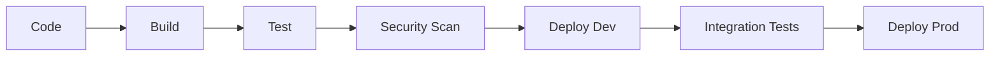

# Stack Técnico RiccoAgency

## Infraestructura Base

### Cloud Infrastructure
```yaml
Primary:
  Provider: Azure
  Services:
    - AKS (Kubernetes)
    - Azure Database
    - Azure Cache
    - Azure Storage
    
Backup:
  Provider: AWS
  Services:
    - EKS
    - RDS
    - ElastiCache
    - S3
```

### Container Orchestration
```yaml
Development:
  - Docker Compose
  - Local K3s

Production:
  - Kubernetes (AKS)
  - Helm charts
  - Custom operators
```

### Networking
```yaml
Components:
  - Ingress NGINX
  - Cert-manager
  - Azure Front Door
  - Private VNet
```

## Core Services

### 1. n8n Platform
```yaml
Edition: Enterprise
Scale: Multi-instance
Features:
  - Custom nodes
  - Webhook handling
  - Credential management
  - Workflow management
```

### 2. Databases
```yaml
Operational:
  Type: PostgreSQL
  Version: 14
  Mode: HA Cluster
  
Cache:
  Type: Redis
  Version: 6.2
  Mode: Cluster
  
Vector:
  Primary: Qdrant
  Backup: Chroma
```

### 3. Message Queue
```yaml
Primary:
  Type: Redis Streams
  Use: Fast processing
  
Secondary:
  Type: Apache Kafka
  Use: Heavy workloads
```

## Development Tools

### 1. IDEs & Editors
```yaml
Primary:
  - VS Code
  - n8n Editor
  
Extensions:
  - n8n Tools
  - REST Client
  - Thunder Client
```

### 2. Version Control
```yaml
Platform: GitHub
Features:
  - Actions CI/CD
  - Project boards
  - Package registry
```

### 3. API Development
```yaml
Tools:
  - Postman
  - Swagger UI
  - OpenAPI Generator
```

## Security Stack

### 1. Authentication
```yaml
Services:
  - Azure AD B2C
  - Auth0 (backup)
  
Features:
  - SSO
  - MFA
  - Role management
```

### 2. Security Tools
```yaml
Scanner:
  - SonarQube
  - OWASP ZAP
  - Snyk

Secrets:
  - Azure Key Vault
  - HashiCorp Vault
```

### 3. Compliance
```yaml
Standards:
  - ISO 27001
  - SOC 2
  - GDPR
```

## Monitoring & Observability

### 1. Metrics
```yaml
Stack:
  - Prometheus
  - Grafana
  - AlertManager
  
Custom:
  - Business metrics
  - Cost tracking
  - Usage analytics
```

### 2. Logging
```yaml
Stack:
  - Elasticsearch
  - Logstash
  - Kibana
  
Features:
  - Log aggregation
  - Search
  - Alerts
```

### 3. Tracing
```yaml
Platform:
  - OpenTelemetry
  - Jaeger
  
Integrations:
  - n8n workflows
  - API calls
  - Database queries
```

## Development Environment

### Local Setup
```yaml
Requirements:
  - Docker Desktop
  - VS Code
  - Git
  
Optional:
  - K3s
  - Minikube
  - ngrok
```

### CI/CD Pipeline


## Deployment Configurations

### Development
```yaml
# docker-compose.yml
services:
  n8n:
    image: n8nio/n8n
    ports: ['5678:5678']
    
  postgres:
    image: postgres:14
    
  redis:
    image: redis:6.2
    
  qdrant:
    image: qdrant/qdrant
```

### Production
```yaml
# helm values.yaml
n8n:
  replicas: 3
  resources:
    requests:
      cpu: 1
      memory: 2Gi
      
postgresql:
  mode: replication
  replicas: 3
  
redis:
  cluster:
    enabled: true
    replicas: 3
```

## Backup & Recovery

### 1. Database Backup
```yaml
Schedule:
  Full: Daily
  Incremental: Hourly
  Retention: 30 days
  
Storage:
  - Azure Blob
  - S3 Backup
```

### 2. Application Backup
```yaml
Components:
  - n8n workflows
  - Credentials
  - Configurations
  
Automation:
  - Daily export
  - Git backup
  - Cloud storage
```

## Cost Optimization

### 1. Resource Management
```yaml
Strategies:
  - Autoscaling
  - Spot instances
  - Resource limits
  
Monitoring:
  - Cost alerts
  - Usage tracking
  - Optimization recommendations
```

### 2. Environment Sizing
```yaml
Development:
  CPU: minimal
  Memory: 4GB
  Storage: 20GB
  
Production:
  CPU: 4-8 cores
  Memory: 16-32GB
  Storage: 100GB+
```

## Roadmap Técnico 2025-2026

### Q4 2025
1. Base Infrastructure
   - Docker Compose setup
   - Basic monitoring
   - CI/CD pipeline

### Q1 2026
1. Production Ready
   - Kubernetes deployment
   - HA databases
   - Security hardening

### Q2 2026
1. Scale Out
   - Multi-region
   - Advanced monitoring
   - Cost optimization

### Q3-Q4 2026
1. Enterprise Grade
   - Full compliance
   - Advanced security
   - Custom tooling